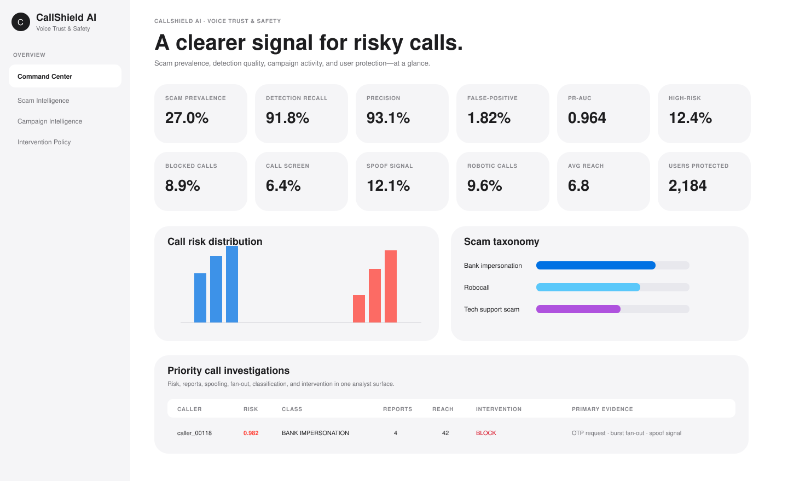

<div align="center">

# ☎️ CallShield AI

### Voice Trust & Safety Intelligence

**Know when a call doesn't feel right.**

`Transcript NLP` · `Behavioral ML` · `Anomaly Detection` · `Ensemble Risk` · `Explainability` · `Campaign Intelligence`

</div>

<br/>

<p align="center">
  
</p>

<p align="center"><sub>Command Center · synthetic portfolio demonstration</sub></p>

---

## A voice-safety system, not just a classifier.

CallShield AI is an end-to-end Trust & Safety data science platform for identifying scam calls, understanding coordinated abuse, explaining risk, and translating model outputs into proportional product interventions.

The product combines **what was said, how the caller behaves, how widely they are reaching, whether the behavior is anomalous, and whether it resembles a coordinated campaign**.

```text
call event
   │
   ├── transcript intelligence
   ├── behavioral signals
   ├── spoof / identity signals
   ├── acoustic-style indicators
   └── campaign context
             │
             ▼
       ensemble risk
             │
      explain + calibrate
             │
             ▼
ALLOW → LABEL → CALL SCREEN → SILENCE → BLOCK
```

---

## Product surfaces

| Surface | Purpose |
|---|---|
| **Command Center** | 18 KPIs, model health, ecosystem risk, investigation queue |
| **Scam Intelligence** | scam taxonomy, transcript cues, spoofing, behavioral evidence |
| **Campaign Intelligence** | coordinated callers, fan-out, script repetition, report concentration |
| **Intervention Policy** | graduated user protection from allow through block |
| **ML Model Lab** | baseline-vs-champion comparison, anomaly detection, ensemble analysis, feature importance |

All five Streamlit surfaces use the same visual system: **SF/Helvetica-style typography, white and soft-gray surfaces, restrained blue accents, rounded cards, subtle borders, generous whitespace, and minimal visual noise**.

---

## 18 ecosystem KPIs

| Detection quality | Protection & ecosystem | Emerging abuse signals |
|---|---|---|
| Scam prevalence | Blocked calls | Campaign candidates |
| Detection recall | Call-screen rate | Repeated-script rate |
| Precision | Spoof-signal rate | Credential-request rate |
| False-positive rate | Robotic-call rate | Payment-request rate |
| PR-AUC | Average recipient reach | Reported-call rate |
| High-risk traffic | Users protected | New-number high-risk rate |

**Primary product guardrail:** legitimate-call false-positive rate **≤2%** at the selected operating threshold.

---

## Scam taxonomy

```text
LEGITIMATE

UNWANTED OR HARMFUL
├── Robocall
├── Telemarketing
├── Bank impersonation
├── Tech-support scam
├── Government impersonation
├── Account-takeover scam
└── Investment / crypto scam
```

---

## Signal intelligence

| Signal family | Example features | Why it matters |
|---|---|---|
| **Transcript intelligence** | urgency, credential requests, payment language | captures social-engineering intent |
| **Behavioral ML** | calls/hour, recipient fan-out, reports, duration | captures abnormal caller behavior |
| **Identity / spoofing** | new number, spoof indicator | captures identity uncertainty |
| **Acoustic proxy** | robotic-voice score | supports robocall detection |
| **Campaign context** | repeated scripts, reach, reports | surfaces coordinated abuse |
| **Novelty detection** | distance from legitimate baseline | catches behavior outside known labels |

---

## ML Model Lab

CallShield compares multiple modeling perspectives rather than relying on one classifier.

```text
Transcript + numeric baseline ──► Logistic + TF-IDF

Behavioral features ────────────► XGBoost ───────┐
                                                 │
Legitimate behavioral baseline ─► Isolation Forest
                                                 │
                                                 ▼
                                      Ensemble Champion
                                                 │
                                      threshold under ≤2% FPR
                                                 │
                                      explanation + policy
```

| Model | Purpose |
|---|---|
| **Logistic + TF-IDF** | transparent transcript + numeric baseline |
| **XGBoost** | nonlinear behavioral interactions |
| **Isolation Forest** | novel behavioral anomaly detection |
| **Ensemble Champion** | combined production-oriented risk score |

Evaluation uses **PR-AUC, ROC-AUC, precision, recall, false-positive rate, and operating threshold** on a common holdout population.

---

## Explainable risk

The product is designed so a high-risk call can be accompanied by analyst-readable evidence rather than only a score.

```text
CALLER       caller_00118
RISK         0.982
CLASS        BANK IMPERSONATION
ACTION       BLOCK

credential_request       +0.31
unique_recipients_1h     +0.22
spoof_signal             +0.17
repeat_script_similarity +0.11
normal_duration          -0.05
```

> The current Model Lab exposes tree feature importance. Native per-call SHAP values are a documented production extension; the README preview represents the intended local-explanation experience rather than claiming generated SHAP values already exist in the pipeline.

---

## Campaign intelligence

Individual risk is aggregated into caller-level campaign risk using:

`recipient fan-out` · `average model risk` · `report volume` · `script repetition` · `spoof rate` · `observed scam concentration`

This helps surface abuse that becomes obvious only when activity is viewed as a coordinated pattern.

---

## Repository architecture

```text
-CallShield-AI/
├── assets/
│   └── dashboard-preview.svg
├── dashboard/
│   ├── app.py
│   ├── ui.py
│   └── pages/
│       ├── 1_Scam_Intelligence.py
│       ├── 2_Campaign_Intelligence.py
│       ├── 3_Intervention_Policy.py
│       └── 4_ML_Model_Lab.py
├── src/
│   ├── generate_data.py
│   ├── features.py
│   ├── model.py
│   ├── model_lab.py
│   ├── campaigns.py
│   ├── interventions.py
│   └── run_pipeline.py
├── tests/
│   └── test_pipeline.py
├── .streamlit/
│   └── config.toml
└── requirements.txt
```

---

## Run locally

```bash
python -m venv .venv
source .venv/bin/activate
pip install -r requirements.txt
python src/run_pipeline.py --rows 30000
streamlit run dashboard/app.py
```

Generated artifacts:

```text
outputs/scored_calls.csv
outputs/campaigns.csv
outputs/ml_lab_scored.csv
outputs/model_comparison.csv
outputs/feature_importance.csv
outputs/ml_lab_summary.json
```

---

## Production evolution

A production implementation could add **multilingual ASR, transformer transcript embeddings, speaker embeddings, native per-call SHAP values, STIR/SHAKEN attestation, carrier reputation, device/number graphs, temporal graph neural networks, market-specific calibration, drift monitoring, analyst feedback loops, challenger-vs-champion deployment, and privacy-preserving aggregation**.

---

## Data & scope

All callers, recipients, transcripts, reports, acoustic indicators, and outcomes are **synthetic**. The project demonstrates applied data science, Trust & Safety measurement, ML evaluation, explainability, and product decisioning rather than representing production telecom data.

---

<div align="center">

### Protect people from harmful calls without disrupting legitimate communication.

**Voice Safety · NLP · XGBoost · Anomaly Detection · Ensemble ML · Explainability · Campaign Intelligence**

</div>
